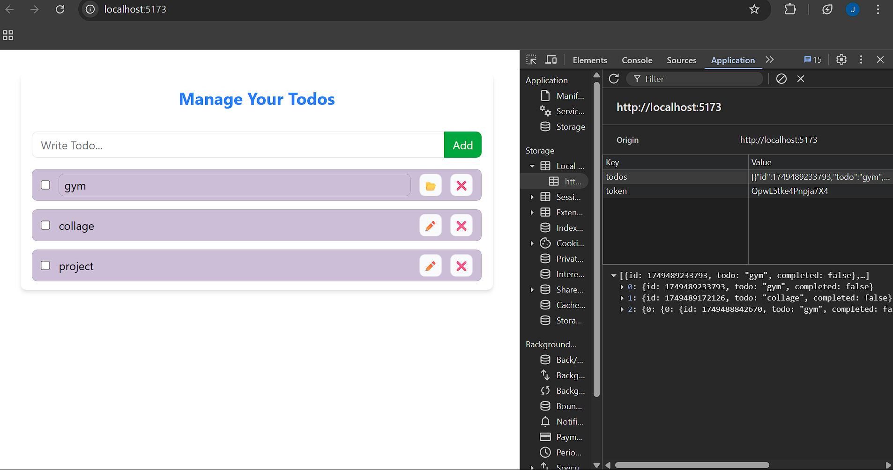

# 📝 React Todo App

A simple and responsive **Todo App** built with **React** and **Tailwind CSS** for practising context API.


---
## Have a look
#### https://todo-fawn-eta-68.vercel.app/
---

##  Features

- **Add Tasks** – Easily type and add new todo items.
- **Edit & Save** – Modify existing todos and save the changes.
- **Mark Completed** – Check the box to mark a task as done.
- **Delete Tasks** – Remove todos permanently.
- **Persistent Storage** – All todos are saved in the browser’s `localStorage`.

---

##  Tech Stack

- **React.js**
- **Tailwind CSS** 
- **JavaScript (ES6+)**


---

##  Screenshots




---
##  Installation

   ```bash
# Clone the repository

   https://github.com/sntripathi180/Todo.git
   
   cd Todo
   
# Install dependencies
   npm install

   # Start the app
    npm run dev
